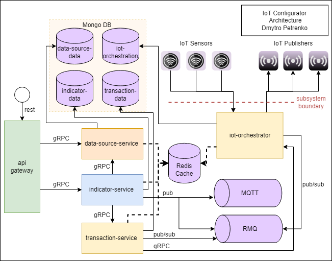

# IoT Configurator

The **Internet of Things (IoT)** describes physical objects with sensors, processing ability, software, and other technologies that connect and exchange data with other devices and systems over Internet or any othe communications networks. 

**IoT Configurator (iotcon)** is planned to be a part of the IoT generic data for any system and can be seen as separate IoT system or as IoT subsystem and freely integrated due to the possibility of addition of specific protocols (opcua, modbus, rmq, mqtt, insite and so on), which are implemented through DataSource abstraction, management of required connectors via **Indicators** as high-level abstraction over sensor/publishers and variables, orchestrating low-level modules in Transaction-Orchestrator pipe for futher data processing from edge devices. **Iotcon** ensures that required IoT data lifecycle is processed quickly via connector modules, logically organized through local events and can be operated on at any enterprise level. 

**Why indicators?** - in my opinion, current IoT state is quite complicated to the end-user, it still remains interconnection of unknown terms. With **Indicators** it's quite evident, that there is some data, which indicates some part of flow (it will relate 1:1 to IoT `variable` in scope of specific `connector`). With use of `Indicator` user doesn't really care of connector setup (like sensor taking some data and passing it to publisher) and only focuses on data with specific unit measurement and class. So in fact `Indicator` flow should be close to [Global Variable Devices](https://docs.devicewise.com/Content/Products/GatewayDevelopersGuide/Devices/DeviceTypes/GlobalVariables/Global-Variables-device.htm) for basic understanding of the idea 

## dev documentation

- [Monorepo Setup and Management](./.docs/monorepo/README.md)
- [Project libraries](./.docs/libs/README.md)
- [Project board](https://github.com/users/Demiez/projects/2)

# Design

Architecture of **Iotcon** is shown on below diagram, iotcon subsystem can represent a part of Overall IoT System Architecture:

# Supported data sources

**Iotcon** dataSources serve as generic source of data standartization, with specific default fields, which will be managed on deeper layers of IoT system. The number of configured fields differ. In current system implementation only basic and not all dataSource fields are taken (they are available for extension), mostly with aim to identify that mandatory data of specific type can be persisted in the system.

**Iotcon** has the following supported data sources for connectors (these are added as examples, with the links to documentations):

- INSITE ([Intelligent Edge](https://www.insight.com/en_US/what-we-do/expertise/intelligent-edge.html))
- MQTT ([MQTT: The Standard for IoT Messaging](https://mqtt.org/)
- OPC Unified Architecture ([OPCUA](https://opcfoundation.org/about/opc-technologies/opc-ua/))
- RMQ ([RMQ for IoT](https://funprojects.blog/2018/12/07/rabbitmq-for-iot/))
- MODBUS ([Modbus Refference](https://www.modbus.org/docs/PI_MBUS_300.pdf))
- Wellsite Information Transfer Specification ([WITS0](https://info.erdosmiller.com/blog/wits-wellsite-information-transfer-specification-fundamentals))

# Understanding base IoT Orchestration

**Iotcon** uses **IoT Orchestrator** to perform orchestration for IoT side, which includes the following base functionality (futher development could be required depending on the subsystem integration/setup):

- iot modules schemas and templates management
- transactions processing and logging
- module configs storage and retrieval

`IoT module` should be considered a base functionality item and is itself a connector (sensor/publisher) with specific variables. Manipulations over modules are performed via `transactions`, each one is supposed to have some number of `operations` for modules. Operation holds `transactionId` field, as a mark for transaction service to identify the result of transaction, `mode` and `config` fields (each config depends on dataSource type). Before the module creation there is a need to specify `schema` and `template` that are also different and depend on dataSource type.

Each `transaction` must be logged and linked as 1:M relation to operations (because each transaction can have a link multiple performed operations, each of these has own module and mode). `Transaction` can have 2 generic states (complete and not complete, that are presented by boolean field `isComplete`). Failed transactions must still have logged moduleIds and operationModes.

`Modules storage` (precisely their configs) is performed in JSON stringified format as generic approach in current implementation for extensible solution, because types of possible configs can vary in different IoT systems. Still it is possible to extend to different nested schema types, if needed.

The following limitations also apply:

- All transactions automatically marked as complete and cannot fail (no integration with external IoT/Edge system)
- Nested stored config types absent on the level of Orchestrator
